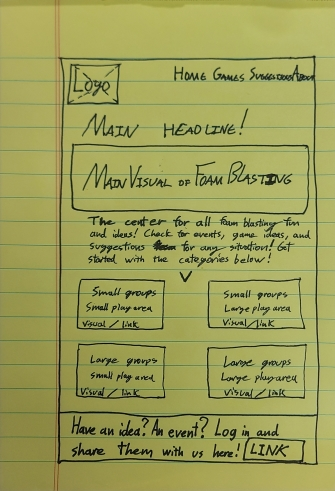
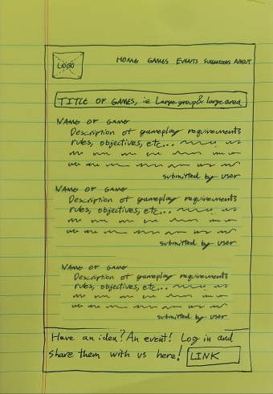
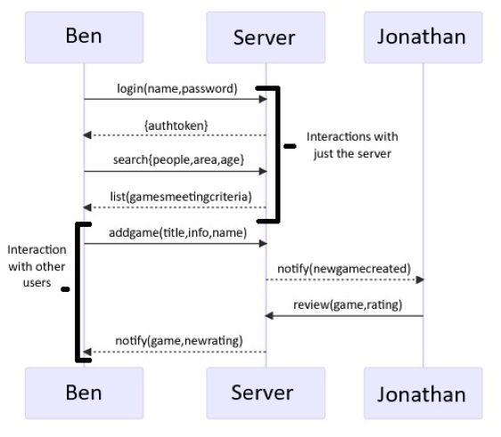

# Dart Battles
### Elevator Pitch
Have you ever looked for new and exhilrating ways to play with foam dart blasters to no avail? Then look no further! Regardless of age, skill, or resources, Dart Battles provides a forum for people to share unique dart blasting scenarios and games. Keep up to date with experienced players sharing their best ideas and new ones reviewing them. Whether you're a hosting a birthday party, a corporate event, spending time with friends, or even a family get together, you can research and host a fun and fair dart blasting session with confidence.

### Design
Below are visuals for a home page and an example forum page, respectively.

 

Below is a visual of how the users may interact with the backend.

### Key Features
+ Secure login over HTTPS
+ Display of recommended searchs
+ Ability to custom search by selecting key parameters
+ Ability for users to submit their own games ideas
+ Ability for users to rank and review published game ideas
+ Notify users when their submissions have been reviewed or ranked
+ Admin can filter, tag, and sort user publications as needed

### Use of Technologies
The required technologies for this course will be applied as follows
- **HTML**
    - Correct structure for application
    - Three pages. One home page, one to search and return results, and one for logging in.
- **CSS**
    - Mobile and desktop formatting 📱💻
    - Invites user to scroll
    - Color scheme that matches images provided
- **JavaScript**
    - Provides login / sign up service
    - Display current rankings for submissions 💯
    - Backendpoint calls
- **Service** - Backend servce with endpoints for:
    - Logging in
    - Searching and displaying game ideas
    - Submitting game ideas
    - Ranking and reviewing submissions
    - Notfiy users of new submissions 📧
- **DB** - Stores the following in a database
    - Users
    - Search Querys
    - Game Ideas
    - Reviews and Rankings
- **Login**
    - Register and login users
    - Store credientials and contact information 🔒
    - Can't submit, rank, or review unless authenticated.

> [!NOTE]
> I don't fully _understand the capabillities or purpose_ of the following two technologies. **_However_**, I have filled them out to the best of my abillities!

- **WebSocket**
    - Whenever a submission is posted, it notifies all users with an account
    - Whenever a submission is ranked or reviewed, it notifies the author 
- **React**
    - Application ported to use the React web framework.

## HTML deliverable

For this deliverable I built out the structure of my application using HTML.

- **HTML pages** - Three HTML pages that serve as: a landing page, a search/forum page, and a login page, respectively.
- **Links** - The login page automatically links to the search page.
- **Text** - Each of the game descriptions are represented by text.
- **3rd Party Service Calls** - Placeholder for motivational battle quotes on the main page.
- **Images** - Main Page implements temporary pictures that represent the application.
- **Login** - Input box and submit button for login.
- **Database** - The example post represents data pulled from the database.
- **WebSocket** - On the search page there is a section for notifications about posts when they're created.

## CSS deliverable

For this deliverable I styled the application.

- **Header, footer, and main content body**
- **Navigation elements** - I dropped the underlines and changed the color for navigation elements.
- **Responsive to window resizing** - My app looks decent on different window sizes and devices.
- **Application elements** - Balanced color scheme and whitespace.
- **Application text content** - Consistent fonts, clean sizing and spacing.
- **Application images** - Alligned correctly, and put in a grid where applicable.

- ## JavaScript deliverable

For this deliverable I implemented JavaScript for the following features/technologies.

- **login** - Can create a user and stores it in localStorage. Can then log in using the log in section. Open to future connections.
- **database** - Displays the posts from local storage. Option to create new posts locally, option to connect later.
- **WebSocket** - I used the setInterval function to periodically announce a new post. This will be replaced with WebSocket messages later.
- **application logic** - I don't totally understand what this is asking for, however my submission matches everything in the assignment description.
