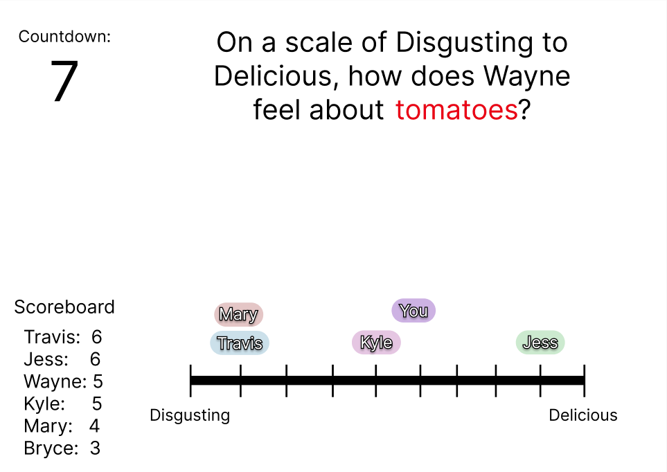

# Rank It 

This application allows players to test how well they know their friends’ opinions on fun and unexpected scales. Rank It is a multiplayer guessing game designed for social interaction and engagement. The app allows up to 8 players per game and tracks scores across rounds. It combines creativity, humor, and real-time collaboration, ensuring an entertaining experience for all participants.

[Check out the app's current progress here!](https://brycelasson.click)

---

## Specification Deliverable  

### Elevator Pitch 🛗  
Have you ever wondered how well you know your friends’ niche opinions? Rank It is the ultimate social guessing game where players compete to match their friends’ opinions on dynamic, creative scales. From scales like "disgusting to delicious" to "old-fashioned to modern", Rank It keeps everyone engaged with fun clues, real-time voting, and friendly competition. Create or join a game, and see how well you know each other!

### Design
The app has three primary views:  
1. **Login Page**: Securely log in or create an account to start playing.  
2. **Game Setup Page**: Create or join a game using a unique code.  
3. **Game Page**: Displays the scale, countdown timer, player sliders, and live scoreboard.  

Mockup images of the Game Page for desktop and mobile are attached below:

#### 💻 Desktop:

#### 📱 Mobile:

Here is a sequence diagram showing interactions between players, the backend, and WebSocket when voting.

### Key Features 🔑
- Secure login over HTTPS.  
- Create or join a game with up to 8 players.  
- Unique scales fetched from the database for every round.  
- Real-time slider adjustments visible to all players via WebSocket.  
- Automatic scoring after each round with live leaderboard updates.  
- Content moderation for player-submitted clues using an external API.  
- Persistent storage of game data, including scores and scales used.

### Technologies  

**HTML**  
Provides structure for login, game setup, and gameplay pages with form inputs, dynamic scoreboards, and interactive elements.  

**CSS**  
Ensures responsive design and styling with animations for voting interactions.  

**React**  
Manages state and routing between views with reusable components and real-time updates.  

**Service**  
Backend service with endpoints for:  
- `login`: Authenticates users securely.  
- `fetchScales`: Retrieves unique scales from the database.  
- `submitClue`: Allows the "it" player to submit a clue.  
- `submitVotes`: Processes and stores player votes for scoring.  
- External API: Filters inappropriate clues using a moderation API.  

**Database/Login**  
Stores user accounts, hashed credentials, game data, and tracks used scales for unique rounds.  

**WebSocket**  
Broadcasts real-time slider updates, locked-in results, and live game events to all players.  

## HTML Deliverable

I added a Statistics page, but other than that, I stuck to my original plan. Below shows what I implemented.

- [x] **HTML pages** - Four HTML pages were created to represent key components of the application:
  - `index.html`: Home and login page.
  - `create_or_join.html`: Page for creating or joining a game.
  - `play.html`: Gameplay page.
  - `statistics.html`: Statistics page displaying user game data.
- [x] **Links** - Navigation links connect all pages via the `<nav>` menu. Links allow seamless transitions between the home, game setup, gameplay (only accessible by joining or creating a game), and statistics pages.
- [x] **Text** - Informative textual content includes:
  - Game rules and how-to-play guide (`create_or_join.html`).
  - Gameplay details (`play.html`).
  - User statistics (`statistics.html`).
- [x] **Images** - Images such as `logo.png` and `user_black.svg` are used in headers and forms across all pages.
- [x] **3rd Party API Calls** - The API will be called on the clue input field in (`play.html`), and the response will be displayed to everyone. You can check the code for more details by searching for "API".
- [x] **DB/Login** - Placeholders for database data are present:
  - Login form with username and password fields in `index.html`.
  - Game-related data like clue scales in `play.html`.
  - Player statistics such as games played and total points in `statistics.html`.
- [x] **WebSocket** - Real-time updates are planned and indicated:
  - Dynamic clue and vote updates in `play.html` using WebSocket placeholders.

## CSS Deliverable

I properly styled my application to achieve its final appearance. It included some changes to the HTML as well.

- [x] **Header, footer, and main content body** - Ensured consistent styling across the application’s layout.
- [x] **Navigation elements** - Customized anchor element colors to match my startup's theme.
- [x] **Responsive to window resizing** - The app is fully responsive, providing an optimal experience on all window sizes and devices.
- [x] **Application elements** - Applied good contrast and whitespace to enhance readability and visual hierarchy.
- [x] **Application text content** - Maintained consistent font usage for a cohesive design, and used proper headings.
- [x] **Application images** - Styled the icon images to maintain their size and move accordingly, and animated the stars images.

## React Deliverable Phase 1: HTML/CSS

I used React to build out the components and structure of my application from my HTML and CSS files.

- [x] **Bundled using Vite** - done!
- [x] **Created Components** - I created React components containing the HTML and CSS for each of my 4 main pages.
      - Note, the play page is only accessible by joining or creating a game on the home page.
- [x] **React Router** - Implemented BrowserRouter and a Route for each page. Also updated the form logic to navigate between pages properly.

## React Deliverable Phase 2: Reactivity 

For this deliverable I used React so that the application works, and I also added placeholders for future technology, that use randomization and occasional timed updates to look realistic.

- [x] **All functionality implemented or mocked out** - Everything is working! Users and games are stored in a global context. `setInterval` used to simulate other player voting.
- [x] **Hooks** - Used `useState` and `useEffect` for each page, and created a custom hook/context useGame.

## Service deliverable

For this deliverable I added backend endpoints that create games, join players to games, and manage user stats.

- [x] **Node.js/Express HTTP service** - done!
- [x] **Static middleware for frontend** - done!
- [ ] **Calls to third party endpoints** - I didn't have time to implement this.
- [x] **Backend service endpoints** - Placeholders for login that stores the current user in the app context. Endpoints for game creation and joining.
- [x] **Frontend calls service endpoints** - I did this using the fetch function.
- [X] **Supports registration, login, logout, and restricted endpoint** - Supports registration, login, and logging out. Restriction is applied to the endpoints.

## DB/Login deliverable

For this deliverable I associate the statistics with the logged in user. I stored the users and stats in the database.

- [x] **Stores data in MongoDB** - Done!
- [x] **Use MongoDB to store credentials** - Stores users and their statistics. Games are not stored, since they are designed to only last temporarily, and are placeholders for the websocket deliverable.
